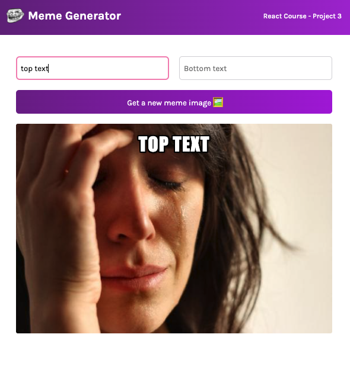

## Table of contents

- [Overview](#overview)
  - [Screenshot](#screenshot)
  - [Links](#links)
- [My process](#my-process)
  - [Built with](#built-with)
  - [What I learned](#what-i-learned)
  - [Continued development](#continued-development)
- [Author](#author)
- [Acknowledgments](#acknowledgments)

## Overview

### Screenshot

### Links

- Live Site URL: [Deployed with netlify](https://incandescent-nougat-7cb478.netlify.app/)

## My process

### Built with

- Create react app
- CSS custom properties
- [React](https://reactjs.org/) - JS library

### What I learned

This was a react refresher course for me to get more acquanted with hooks, especially useState and useEffect. 

### Continued development

I would like to come back and zhuzh up the CSS or switch to SASS in the future

## Author

- LinkedIn - [Layne Taylor](https://www.linkedin.com/in/layne-taylor/)
- Twitter - [@laynerzzzz](https://twitter.com/laynerzzzz)

## Acknowledgments

I used Bob Ziroll's learn react for free course on Scrimba. It's great for people just learning react but it's also great for people like me who just need to learn hooks. The course has more front-end content than most react courses I've used which I really liked as well.
